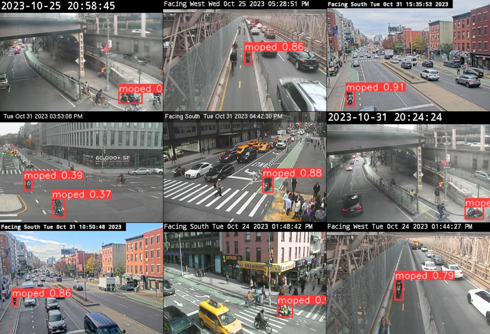

<h3>tl;dr</h3>
New York City's streets are a pretty crazy place, they can be fun and exciting, but also dangerous. Amid a steady increase in complaints by ordinary citizens, police enforcement has plummeted all while there's been a surge in illegal gas powered mopeds taking to the streets. Here are some things I found:

+ <u>Cops don't always do what they say they do:</u> In <b>more than a third</b> of cases where police say they wrote a ticket after someone complained about illegal parking in the past decade, no matching summons could be found.
+ <u>The NYPD doesn't enforce the law on itself:</u> Less than 2 percent of illegal parking complaints filed within a block of a police precinct resulted in a ticket over the same period, with many officer's [chronically parking](https://www.sciencedirect.com/science/article/pii/S2590198223000635?via%3Dihub) on sidewalks and in bike lanes.
+ <u> Complaints are up, enforcement is down:</u> Complaints about illegal parking have increase more than seven fold between 2014 and 2023, while
tickets issued by police officers have dropped by 67 percent.
+ <u>A moped illegally crosses the 59th Street Bridge every five minutes:</u> I trained a custom object detection model using existing traffic cameras and recorded mopeds frequently crossing the span shared with pedestrians and cyclists. That's dangerous!
+ <u>Car crashes and complaints are linked:</u> There is a positive correlation between the location of vehicle crashes where at least one person was injured or killed and the number of 311 complaints about illegal parking, faulty traffic signals and street lighting.
+ [[TK information on the ML model]]

 This was done by cross referencing complaints (not an easy task) with data from the NYC Department of Finance, which collects payment for parking tickets.

I found that the police have been doing less
enforcement, especially when it comes to complaints generated by local residents.
I built a custom dataset to better understand traffic injuries and fatalities using
machine learning. Finally, to illustrate the chaos that is felt on the streets I 
trained a custom AI object detection model using a network of existing traffic 
cameras to show how illegal gas-powered mopeds increasingly use space reserved 
for pedestrians and cyclists.

<h2>Lack of Enforcement</h2>

<iframe title="As Illegal Parking in NYC Grows, the Police Issue Fewer Tickets" aria-label="Interactive line chart" id="datawrapper-chart-mr9s9" src="https://datawrapper.dwcdn.net/mr9s9/4/" scrolling="no" frameborder="0" style="width: 0; min-width: 100%" height="664" data-external="1"></iframe>

<figure style="display: block; margin: 0 auto; max-width: 800px;">
</figure>